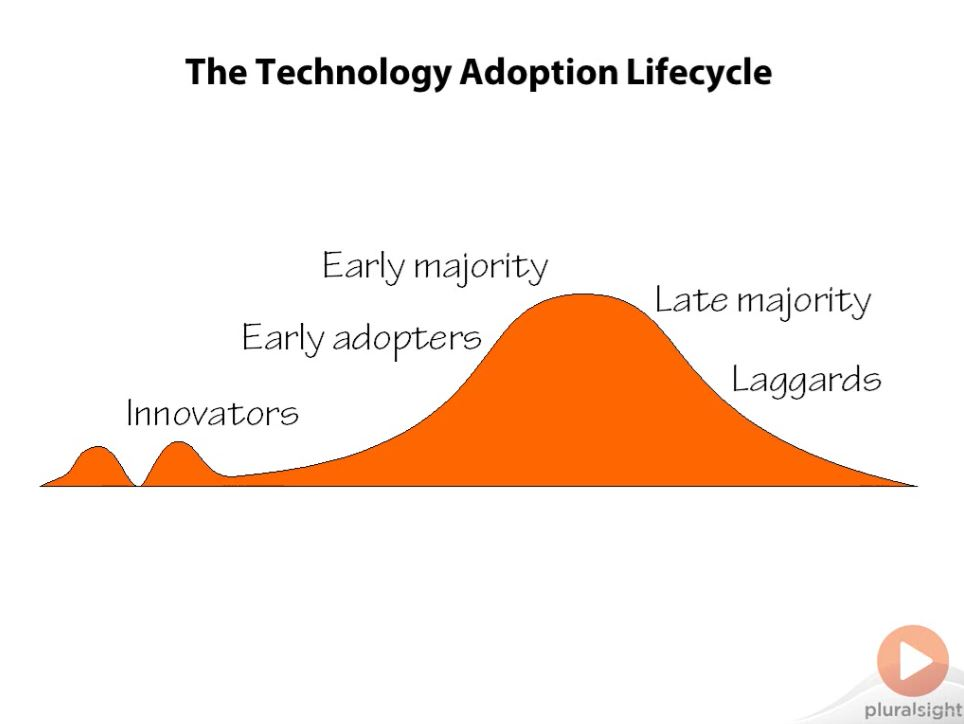
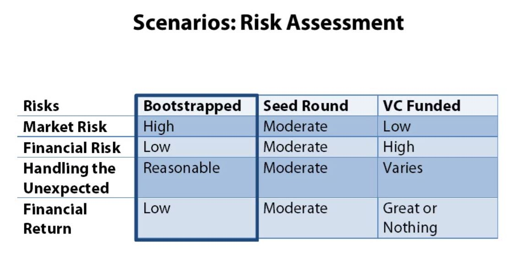
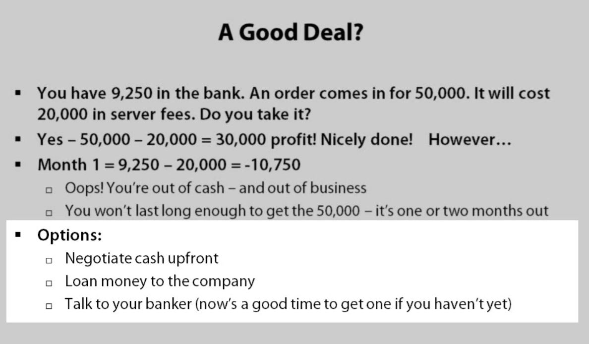

So You Want To Be An Entrepreneur
=================================
Entrepreneurs who often dream of billions usually only reach a million or two (not that bad...)
# How to Make Money
* Sell Your Time
    * Doesn't scale well
* Sell Something You Own
    * Traders/Merchants/etc.
* Sell the Use of Things You Own
    * The more you own, the more you can make money
* Sell the Things you Create
    * The best scaling

It takes skills to be an entrepreneur, but those skills can be learnt.
50% of the population were self-employed in the 1800s.

# Goals, Personal and Corporate
## Entrepreneurship is about money
Harsh, but nonetheless true.

Kind of goals:
* Change the world
* Be your own boss
* Sleep in

If it wasn't about the money, one could volunteer to change the world instead...

Still, those goals are important, they allow to define what money means to us.

If the goal is to be our own boss, VC is not the way to go, because they will watch every move we make.

If the goal is to get a mansion, the entrepreneur might take a riskier path that will pay off big time.

So it is important to know how much money defines a success in our personal view.

## Risks
If you cannot tolerate risks, stop trying to become an entrepreneur.

Becoming an entrepreneur is a lifestyle choice, and very hard to reverse. Be wary!

## Glossary (funding and investment)
### Investment
* Equity
    * Represents ownership in a business
* Cost of Entry/Startup Cost
    * The cost to start a business
* Bootstrapping
    * When startup and operating costs are covered entirely by the founders, even during evenings and weekends while having a part-time job.
### Funding
* Friends and Family
* Angels
    * Rich people who invest in startups to become richer
* Venture Capital (VC)
    * Professional investors who manage funds of money they raise from rich people who want to become richer
* Dilution
    * When the maount of equity you have in your company decreases because new stock is issued to raise money
* Debt & Revenue Based Financing
    * Ways of obtaining funding that does not involve dilution
* Exit strategy
    * When part of all of the equity of your company is sold
        * Good exit: selling to another company at a large profit
        * Bad exit: liquidating the assets of the company at a loss
* IPO
    * Initial Public Offering
        * Selling stock to the public on the open market
* Incubator
    * An organization that provides resources to early stage startups
* Creative Financing
    * Other ways of raising money
        * crowd-sourcing

## Startup Design Patterns
* Grow Fast, Grow Big, Exit
    * Raise money, grow quickly, sell the company
* Niche/Specialized - Moderate Growth
    * Fill a specific need (like me)
    * Not necessarily attractive to VC Firms, the potential exit is not big enough, but it can provide a nice profitable steady business nonetheless!
    * prone to bootstrapping/creative financing
* Lifestyle - Profitable and Stable
    * crowdsourcing, family

## Choosing Your Path
* Choose your pattern based on your needs, not on popularity
* Remember your goals and interests
* Respect your idea. Different investors/advisors may have different agendas or share different vision/values.
* Focus on loving your idea and getting the right clients for it.

# Do You Have What It Takes
Investors invest on people, not ideas.

Entrepreneurship is about character, attitude and skills.

## Confidence
* Self-esteem is the key to success.
* You will face a great deal of skepticism and doubt. You need a bit of conceit.
* Things to be afraid of:
    * My company will fail
    * I'll ship something defective
    * My employees will become unemployed and suffer financial hardship
    * My customers will hate me

Yes, these things will happen. And you will be the one blamed for it. Be ready to face that.
Often, you will have to take blind decisions that will impact your employees. Most of the time you will be guessing because there are factors out of your control.

Be courageous.

## Risk Tolerance
Understand your risk tolerance with the following questions:
* How will you deal witwh failure?
    * What will you do if you fail? What will you do if you lose your entire investment?
* What is the personal cost of this venture?
    * If you fail, will your spouse divorce you? Will you commit suicide?
    * Will it destroy your health? Will you never see your family?
    * If that comes up... you're taking way too much risk!
* What is the financial cost of this venture?

Early career low-risks:
* low epenses
* lots of time to recover from failure

Late career low-risks:
* Extra savings/assets available
* Lower expenses (kids are self-supporting)

Mid-career high risks:
* High expenses
* Large commitments

Rule: Never Risk What You Are Not Willing To Lose

## Stress Tolerance
* A shit ton of symptoms...
* BUT! actually, CEOs tend to be healthier than their employees.
    * I can speak for a fact that I indeed got into healthy habits since I started working on my company
        * Higher self-discipline with regards to exercise and diet
        * It's good to be the boss
        * Get to sleep late when you want to
        * If you wake up early, it's because you want to, not because somebody else wants you to.

## Business Skills
* Basic accounting / bookkeeping
* Graphics
* Writing
* Marketing and advertising
* Web
* Public Relations
* Legal
    * Protecting IP / Sales Agreements / Stocks / Partnership Agreements / etc.
* Sales
* Human Resources
* IT
    * software licenses / emails / web services / phones / internet access
* Office

These things need to be done.
* Hire people to do it for you: gets highly expensive
* Do them yourselves
    * online courses
    * books
    * occasional consultation with experts
* Do it yourself and have an expert polishing it
* One big thing to note: the experts in these various fields often are not very good at what they do.

## Technical Skills
* You don't necessarily need to be a "top coder"
* You can be an *entrepreneurial coder*
    * An entrepreneurial coder writes code based on the economics of the code, not performance/efficiency/popularity/etc.

Economics:
* Coding is maybe 20% of your lifecycle costs.
* Buy instead of build? Long-term risks?
* Consider the cost/benefit ratio

Taking Shortcuts: Neglecting documentation/unit tests/etc.

But that accumulates technological debt/deficit, that you have to tackle the moment you have resources in spare

Understand the risk and cost of every single decision you make.

* Know when to ignore total lifecycle costs
* Find an economic justification for every technical decision
* Don't get blinded by technology

## Management Skills
* Manage yourself first (self-discipline)
    * This is usually not a problem since you're already on the entrepreneurial path in the first place.
    * But what can be a problem is to know when to take breaks: eat well, sleep well, get a life
* You can learn
* You can hire
* When experience is needed, evaluate each individual on their own merits. It's not because the person has grey hair that things will go smoothly.
* Choose between CEO/VP-Engineering/CTO. You can't do all of them
* Managing growth is really hard
    * You may not be able to grow fast enough to do it yourself
    * Zuckerberg/Gates are geniuses not only because of their technical geniuses:
    also because they could maintain control and significant ownership of their company while growing in from nothing into huge organizations
    * It's common that you can't handle the transition.
        * Larry Page and Steve Jobs handed down their CEO position for a while because they couldn't handle the growth.

## Strenghts and weaknesses
* Play to your strengths - compensate for your weaknesses
    * Partner with others who are strong where you are weak

## The vision
* You need a belief and passion that will carry you through the rough times.
* Visions can be shared
* It makes sense that the CEO is the originator of the vision

Do You Have What It Takes?

# The Idea
* Ideas are cheap
* Ideas are easy
* Execution is everything

## Finding ideas
To be creative: don't be scared of being stupid. Spit out all the ideas. Don't filter them out.
Try to come up with the worst ideas possible. Surprisingly, some will be good!

Never stop looking for ideas. Don't think the first idea you came up with is the best one you came up with.

## Ideas, big and small
* Big ideas
    * large market/mass market, requires heavy investment
* Smaller ideas
    * limited market, limited development, infrastructure and marketing costs

## Barriers to Entry
* Simple ideas are bad
    * Other companies can incorporate your idea into their existing product
    * Others can copy and execute before you can
    * If you create a company around a simple idea, you need to create barriers of entry, that is, strategies to slow down or stop the competition
* Hard ideas are better
    * Stealth Mode can help. Nobody really knows what they're working on, so they get a head start.

### Common Barriers of entry:
* Target a small market (less competition, so larger companies will not find it worthwhile)
* Target a market that requires specialized knowledge (domain knowledge)
* Legal techniques (patents and trade secrets)
* Gain dominant market share
* Be the best
* Be the cheapest
* Gain exclusivity to a key resource
    * Negotiate exclusive licenses
* Innovate like crazy

## Creating Demand vs Meeting Demand
Meeting is easier than creating, but creating might give a major competitive advantage.

### How To Know If Your Idea Meets a Demand?
* Ask potential customers if they like the idea
* Ask how much they would be willing to pay for it
* Don't just talk to friends
* Are you the customer?
    * In that case, the question you need to answer is: how many people face the same problems as you?
    * Eat Your Own Dog Food

* If Nobody likes it
    * Maybe you're wrong... Maybe you're right... But just make sure not to fall in love with your idea
        * It is important to be able to discard bad ideas and craete new ones

## The Next Big Thing
* Are you the next Google?
    * Probably not... But to be, don't follow the fads. You have to go against odds.
* Following the latest fad is perfectly ok
    * Even investors follow fads

## Timing
* A great idea for a dying market is a bad idea

## Competition
* Competition serves to prove a market actually exists
* Know your competition in order to differentiate yourself
    * Marketing is about telling a story. You'll need to have a story to differentiate yourself from the competitors

## Protecting Your Idea
* Too much secrecy is dangerous. Feedback is critically important. It can help finding and avoiding critical flaws.
    * We can be opened about the idea and goal but keep implementation secret.

Other possibilities:
* Trade secrets
* Trademarks and Copyrights
    * Protects the brand, not the idea
* Patents
    * Job security for lawyers :P
    * Mostly useful for huge companies

## Business Plans
* See it as a way to tell a story.
* A business plan is not really a business plan. They can't predict the future. Anyone who considers a business plan seriously is a fool.
* They help thinking about how your idea translates into a business
* They help convince investors that you are thinking like an entrepreneur
* They force you to consider all aspects of a business

### Important Topics
* The people
    * What skills do they bring?
* The idea
    * What problem are you solving? Are you meeting/creating a need?
* The market
    * Do you know who your customers are? (to be distinguished with users)
* Competition
    * How will you compete? Who is your competition? Think several moves ahead
* Monetization
* Financial / business model
    * Who is the customer? What will they pay?
        * Helps to estimate a revenue growth
    * Development costs and resources
    * Operating costs
* Financial Plan
    * Describes how we plan to spend money over time

## Idea Mutation and Uncertainty
* Few ideas survive the reality of development unchanged
* Be ready to adapt and evolve (Microsoft and eBay did it)
    * Don't fall in love with your idea. It's simply an idea. Allow it to evolve.

Being an entrepreneur is being in a constant state of uncertainty.

The above questions are guides to help you decide whether you should try to turn your idea into a business. It helps gaging the risks and rewards.

Answer the questions and accept the fact that the answers are nothing but educated guesses. By doing so, you probably are ready to be an entrepreneur.

# The People
## The Founders
* Typically range from 1 to 4 people (usually 2)
* Sole Founder
    * Eliminates stress to resolve disagreements
    * No one to support you, no one else to blame or let you down
    * No risk of divergence in vision
* One cofounder
    * one more skillset
    * adds relationship complexity
    * someone to support you and back you up
* More cofounders
    * increases both risks and advantages of one cofounder

### Choosing a cofounder
* It's like a marriage
* You need a cofounder that can put up with you at your worst, and that you can tolerate at their worst
    * To minimize the risks, ideall go with someone you already know well. But be careful about closest friends, relationship could be ruined if business goes wrong
* Find someone different: look for skills, not knowledge
    * Consider character and integrity first. Confidence that you won't be betrayed.
* Don't look for someone to provide emotional support
    * Need for companionship of fear of beingg on your own are not a good basis for a partnership
    * If it's the case, work on your fear first, because even though you have a cofounder, you'll need to take decisions on your own. and if the partnership breaks up, you may find yourself in that spot regardless
    * If you lack the discipline to do the necessary work, having a cofounder isn't likely to help
    * *If you want a companion to be around and help with the work: hire an intern*
    * *If you want emotional support: buy a dog*
* Look for someone who will increase your chances of success

## Cofounder Relationships
Problems can arise when roles are not well defined. Sometimes, CEO is the clear leader, with the cofounder being close number 2. Sometimes, the CEO is first among equals.
Have periodic open discussions on the topic to avoid unclear/undefined relationships that develop resentment.

Make sure you understand what is going on with your cofounder roles. Never blindly trust and lag behind. Do the efforts to gain the necessary knowledge to understand the other side of the business.
This will avoid potential unfair decisions at your expense.

*Trust but verify!* Greed can bring out the worst in people.

### Break-Ups
It can be amicable (personal reasons), it can be because a partner dies, or because the other founder is a real jerk, and things can get as ugly as things can be, like a divorce with lawyers and trials.
It can take down companies, especially startups.

This is why it is important to be prepared: have Buy-out and Restricted stock agreements.

If the founder is unable to have this kind of discussion, it is a sign that the team is wrong.

Questions to ask ahead of time:

What happens if:

* One of us stops doing their fair share of the work? What is fair?
* One of us gets ill and can't work?
* One of us simply gets tired and doesn't want to continue?
* One of us gets divorced?
* One of us can't afford to continue working, and the company is not yet in the position to pay a salary?
* One of us dies?
* Can we sell all or part of our equity if we want to or need to?

Be sure those questions are answered in writing before starting the company. Otherwise, you could face a situation where your co-founder still owns the company, and leaves, and you have no recourse.

### Vesting
* You own your stock, but don't really own your stock until a certain time.

## Professional help
* You must find professional help if you plan on building a company with more people than yourself.
* You must have a lawyer experienced with startups.
    * How to find a good one? Contact local CEOs of other startups!
    * Will help establishing the business entity and the initial founder agreements
    * Essential for raising money
* Accountant (not bookkeeper)
    * Helps set up the books correctly
    * Tax planning
    * Help preparing financial documents
* Payroll service
* Ask for discounts or offer equity
* Don't stress - they will make mistakes. It's normal.

## Advisors
* Outsiders with skills, knowledge or connections
* Typicaly paid with stock options
* Variety:
    * Business/Industry/Technical advisors
* Listen to advice, but remember: the decision is yours. You know your company better than they do
    * They help explore all facets of a problem
* Connections (customers, partners, investors)
* Credibility: the right advisors can make you look 'real' (industry press, hire potential, etc.)

If incorporated, you will have a board of directors. Ultimately responsible for the company. Initially comprised of founders and key investors.

## Early Hires
* Hire the very best people (A-people)
* The 'best' people for a large company like Google may differ from the 'best' for a startup
    * You need greater flexibility and adaptability (answer phone, manage intern, tech support, attend conferences, etc.)
    * Need managers who still remember how to do real work
        * Sometimes, they spent so much time managing people that they forgot how to actually 'work'
            * e.g. a VP of sales who spent years managing sales people would need this time around to get on the phone and talk to potential customers as well
    * Each person hired will impact culture.
        * Large companies can handle a few brilliant jerks who can't get along with others -- You cannot.
* An A-person is not the smallest person in the room or the most talented: it is a person who knows how to get things done
* Early hires will have a huge impact on the culture: thus, it's important not to judge only on individual merits, but how they will work as part of a team
* Of course, make sure your hires are done legally

## Key Roles
* Experience dilemma: hire cheaper less experienced people, or spend more for experience?
    * Look beyond credentials
* Sales / Marketing / Finance
    * Often, in tech startups, we fail to appreciate the importance of these non-technical roles. That is a mistake.
        * The greatest product in the world can fail if the marketing fails.
* CEO - Chief Executive Officer
    * Usually a founder
    * public face of the company
    * Defines company culture and management process
* COO - Chief Operating Officer
    * Usually, the CEO is the COO until the company grows large
    * Handles daily operation of the company
* CFO - Chief Financial Officer
    * Part time position until the company has grown
    * Corporate finances.
* CMO - Chief Marketing Officer
    * Marketing, Branding, Public Relations
        * Including web presence, presence on social networks, PR
            * Teaches the CEO what to say, and how to apologize when he tweets something really stupid ;)
* VP of Sales
    * Brings in revenue, manages sales, business development (develops partnerships)
* CTO - Chief Technical Officer
    * Responsible for the technical vision of the company
    * Includes engineering management in the early life of the company
* VP Engineering
    * Manages the technical development and establishes development processes. May overlap with CTO.
* VP Product
    * Responsible for the product vision, defining the product and requirements
    * Liaison between engineers, sales, marketing, customers and the executives
* HR Manager
    * Responsible for recruiting, hiring, legally firing, benefits and related issues

*Remember to hire people who know or remember how to do real work.*

*Startups need people who know how to get things done.*

## Finding people/culture
### People
* Personal connections
    * Use nepotism with caution: they should do their best since they care about you, but the problem is: what to do if they don't work out?
        * "*Hey Mom... You're fired! What's for dinner?*"
        * Might forge/lose friendship
    * Question to ask yourself: Would you hire that person if they were not a family member/friend?
* Advisory board and investors (their contacts are likely to be better than yours, use them!)
* And all other methods (job sites, professional recruiters, etc.)

### Culture
Impacts everything. You'll have culture, whether you define it or not.

* Will your company be a fun place to work?
* Will people take risks and initiatives, or be cautious and conservative?
* Will they go out of their way to help customers, or do the absolute minimum for them?
* Will people be passionate about the product, putting extra effort to get the job done, or walk out the door at 5pm?

How to establish culture?

Set the example. Create the culture you want by living it.

# Accounting 0.9
## Watch the Money
**As an entrepreneur, it is always your job to watch and manage the money.**

**It is the one job that you cannot delegate.**

You may have a CFO, or be a CTO who brings in CEO: it does not matter: watching and managing the money is always your job.

Stories that occurred:

I brought in a CEO/CFO/CPA and they:
* blew through our cash
* embezzled
* committed fraud
* stole the company from me

Every founder should watch the books and have at least a basic understanding of the company finances.

This is especially true for CTOs. Not only to protect themselves, but because the business model/financial strategy does have an impact on the technical strategy, from hiring/scheduling/architecture. You cannot be a good CTO if you do not understand the financial strategy of the company.

**Cash is King**. Companies have succeeded without revenue, without profits, but if you run out of cash, it's game over.

## Cashflow scenario 1 - Bootstrapping
Founder investment - built the company on evenings and weekends while holding down jobs, or live off savings while building the product.

The above picture assumes it will take a year of worth to launch the product, so the first 4 quarters have zero revenue.

## Cashflow scenario 2 - Bootstrapping + Seed
Scenario with seed round of $250 000.

Divide your total cash by your average burn rate, and you'll have an idea of how long you have to turn your cashflow positive, or raise more money.

## Cashflow scenario 3 - Agressive growth + VC

This is of course an ideal scenario (like the first one). If the raising of Q4 hadn't worked out, or if revenu hadn't kicked in in Q9, the company would have probably died, or at least gone in intense survival mode.

If revenues hadn't kicked in, they could've gone into Series B funding in Q8.

## Scenario Risk Assessments
Of course, the above scenarios consist of made up numbers.

Spreadsheets do not predict the future. It's a tool to evaluate alternatives.

### Dealing with the Unexpected
* Large companies can afford mistakes and waste money.
* You will make mistakes.
    * You don't have product diversification
    * You have little or no profits
    * Cash provides some extra security

### Scenarios: Risk Assessment

Bootstrapped Market Risk is high, because you may miss the market. Financial Risk is low because expenses are balanced by revenue.

## Bookkeeping 0.9 - Terminology
You can do your own books if you're very small or just starting out. Otherwise, find a part time bookkeeper.

* Accounts
    * Not bank accounts. Think of a table in a database that holds a list of transactions.
        * web hosting account might have 12 entries of monthly fees with the yearly balance
* Accounting Language:
    * credit: put money into an account
    * debit: pull money out of an account
* Asset - Things You Own
    *  checking account, savings account, value of property, accounts receivable (money owed to you by customers)
* Liability - Things You Owe
    * Credit card accounts, money you owe for taxes
* Capital
    * The current value of the investment in the company
    * has nothing to do with the evaluation of the company
* Revenue (income)
    * sales income or licensing fees
    * Money received as investment isn't income. It goes into the Capital account.
* Expenses

## Finding Your Inner Accountant

Don't use spreadsheets. Use real accounting software, such as [QuickBooks](http://quickbooks.intuit.ca/).

Use the data to generate reports:
* Cash Flow
* Income
* Balance Statement

## Cash flow and income reports
### Cashflow Statement

Most important statement, because if the Ending cash equals 0, it's game over.

### Income Statement

Income does not include investment.

The internet expense is counted in step 2, when you charge it to the credit card. Not in step 6 when you paid the credit card.
Paying the credit card is not paying an expense, it's settling a debt that was previously incurred in order to pay an expense.

## Cash, income and deals
Cash statement is as important as income statement, if not more.

## Bankers
You will need a real banker at some point: a banker that specializes in business accounts, who knows the business and with whom you have a relationship.

It's the person who, when you need payment process to be taken care of in the next 30 minutes, will take care of it for you, without having to go through customer service.

That person can solve your problem when you show the deal problem illustrated above. He can arrange line of credit.

He can also help factor receivables, i.e. arrange for a person to purchase the receivables at a discount.

Loans can happen due to the credit-worthiness of the client, not yours!

## Balance sheets and other tall tales

Picture of your overall financial state. Tells you that you've done your bookkeeping correctly.

The total assets should equal the total equity + everything you owe.

Note that accounting is also fiction/story-telling. The numbers are real, of course, but represent choices and decisions (think of the scenario of the credit card debt, or delaying a sale).

There are different ways to tell that story in order to show the operating health of the company, and that's why at some point you will need an accountant and CFO.

# Funding
## Founders
### Founder's Money (Sweat Equity)
First rule in investing: **never invest what you aren't willing to lose**.

It's true that *only total commitment can lead to great success*, but don't take this quote blindly. Don't be stupid over it. Failures occur, and if you invested everything you had, you could end up homeless. For real.

## Friends and Family
* A good way to lose friends and ruin family celebrations.
    * Don't let them invest what they aren't willing to lose.
* If friends and family are sophisticated investors
    * Then they'll understand the odds and won't take a loss personally

## Banks
* Credit cards
* Personal line of credit
* Small business loans
    * usually could cover office equipment
* Other debt financing
    * lines of credit, factoring receivables
* Debt financing is cheap
    * Even high bank interest rates are better than most equity financing

## Angels
* Angels are wealthy individuals who like to keep closer control over their investments. They may not be rich enough for a VC fund.
* Most VC funds require a minimum of $100 000, but more typically, $500 000 - $1 000 000.
* Angels funds usually go from $10 000 to $100 000.
* Angels are the one that will most likely bet on the person rather than the idea.
* Raising money is similar to VC investment, but typically faster. You meet them, you pitch, and if you convince them, they invest.
* Unlike VC investments, you typically offer the term sheet to the angel investors.  They more or less take it or leave it.
* They too are thinking about the exit strategy. Lifestyle companies are less attractive because of that.

## Convertible Notes

What happens if you don't raise series A funding by the end of the note term? Depends on the agreement.
In some cases, you have to pay the debt. In others, the note converts into equity at a set price.

## Venture Capital (VC)
* Most companiges never raise VC money
* Most VC backed companies fail
* Most hugely successful technology companies had VC backing

### A Question of Motive
* Angel investors
    * Financial/Personal motivation
    * Responsible to themselves
* Venture Capital
    * Financial motivation
    * Responsible to their investors
    * They hate picking losers
    * VCs have a primary fiduciary responsibility to their investors. Not to you.

VCs: it doesn't matter how nice they are as individuals, how much they promise to support you, etc. They are not your friends, they are your investors. Their primary goals are to pick winners and maximize their returns.

If things go wrong and you stop looking like a winner, they will do everything it takes to turn things around and minimize their loss. If that means throwing you out, they'll do it.

There has to be an exit strategy. VCs and Angels typically don't make money until the exit.

## VC - The Pitch and the Process
* Create your business plan
    * Recruit an advisor who is familiar with raising VC money, with good connections
* Prepare your pitch
        * PowerPoint presentation + demo, handout printed copies of the slide deck, do a demo, answer their questions and challenges
    * Very much like your business plan
    * People
    * Idea
        * The details don't really matter. VCs know startups succed with variations of the original idea.
    * Market
        * Is it big enough to scale?
    * Competition
        * Do you have a plan to deal with the competition? Will you have a chance to be the market leader?
    * Business Model
        * Do you have a plan to make money?
    * Financial Plan
        * Expected revenue and planned expenses. The plan has to show high growth. They want to see that you know what you'll do with the money they'll invest.

### The Financial Plan
* Tell a good story
    * VCs know it's a work of fiction. But it demonstrates that you understand what it takes to grow the business and that you're not stupid.
    * It shows a growth path. It can be optimistic, but should be reasonably possible to achieve.
    * It shows some realistic near term goals/milestones. Make sure that milestones that show up in a deal are milestones with which you are very confident you can make.
* Rehearse
* Be patient - the process is slow and is a full time job
    * Don't expect to get much sleep
* Due diligence (does your story make sense?)
* The term sheet
    * Call out the lawyers
    * Decide who else gets to play
    * Getting a term sheet will make you very popular among other potential investors
        * (fear of missing out!) No VCs wants to be the VC who turned down Facebook

## Valuation, Dilution and Paperwork
Valuation: It's all about market value: what someone is willing to pay

E.g.: 1 Million at 2.5 Million pre-investment valuation, 3.5 Millions post-investment valuation

In the above scenario, 400K shares are issued because of the 1M investment on a pre-valuation of 2.5M.
Because of the new total number of shares (1.4M), even though you still have 1M of shares, you now own 71% of your company. This is called dilution.

So a higher Series A valuation is better, but it's not always true.

If trouble happens and you need to raise money again but can no longer justify the existing valuation, a downround might occur.

E.g. First valuation is 10M, second valuation becomes 5M. You could end up losing your stake in the company, or having your company go out of business.

It is infinitely better to have a 2.5M round followed by a 5M round than the opposite.

One thing to keep in mind: if you raised the seeds round, this will be the time where the convertible notes convert into series A stock.
The conversion amount will typically be included in the money you raised. So if you're raising a 1M series A and are converting it into 250K seeds round, you would only see 750K in new cash.

After accepting a term sheet, there will be endless paperwork.

Ask questions if there are things you don't understand.

On a series A round, the investing firm will insist on one or more seat on your board of directors.
A typical scenario is a 5% board (founders have 2 seats, investors hold 2 seats, 5th seat is an independent acceptable to both).

The founders still own the majority of the company, but never forget that the company is controlled by the board. CEO is hired/fired by the board.

Are you really sure you want to do this? Consider your original goals of starting a company!

If freedom and independence is your goal, bringing in VC will make you lose freedom and independence.

## VC as Resources
A good VC partner will bring in more than just money:

* They may have more experience than you do
* They know people
    * Other CEO
    * Bankers
    * Other executives
    * Potential acquisition/acquiring candidates
* Brings credibility
    * With customers
    * With press/industry
    * With potential hires
* Bring in more money in later rounds
    * They will be right there with you for the exit strategy as they will want the best deal possible

## Other approaches
What about smaller/lifestyle companies that don't interest VC firms?

* Crowdsourcing
* Revenue Based Financing
    * e.g. receive 500K in return for 10% of your gross revenue for the next 5 years
    * does not reduce your equity share
    * these deals often have a cap, so we might end up paying off the investment early
    * typically done with limited partnership
* Government Grants

Everything is negotiable. Anything is possible.

# Execution
* Coming up with an idea
* Building a team
* Managing finances

## Day One
* Bureaucracy
    * Legal entity
    * Business license
    * Taxing authorities
    * Bank account
    * Sellers permit
    * Registering domains
    * Phone number
    * Insurance
    * Additional bureaucracy depending on your location

## What's in a name?
* Choose your domain name first
* .COM is still golden
    * Grab your country's primary TLD as well
* Do a trademark search
* Avoid offensive terms (or those that sound offensive in another language)
* Don't stress too much - companies can, and do, change their names and logos
    * name doesn't matter until you are ready to get to market, or for destination sites that need large number of visitors
        * even then, the destination site could be a product name

So you don't really need to wait for the perfect company name to get started, especially if you have significant development time ahead of you. And don't spend too much money on the logo, you're bound to change that as well.

## Hiring
If you don't have assets or haven't raised money, you will be paying your hires in the form of stock options. In which case, make sure you consult an attorney/accountant first, or you could break the law and saddle the new hire with worthless stock that they have to pay taxes on immediately.

No matter how good you are at interviewing, sometimes you're going to get it wrong. When you do, cut your losses and let the person go.
If letting the person go in your country is hard, bring them in as consultant/contractor first until you can be confident that it's the right person for the job.

Remember, you need people who fit in your business culture and help develop it.

Make sure you know what questions are illegal to ask.

(Check out [Career and Survival Strategies for Software Developers](https://app.pluralsight.com/library/courses/career-survival-strategies-4devs/table-of-contents)).

Learn management skills as early as possible.
* Take a course. Read a book.
* Good management can make average employees to excel.
* Lousy managers can cause the greatest employees to fail.

The quality of management matters even more than the quality of the people.

Have the confidence to hire people who know things you don't, and who are smarter than you are.

## Culture
* Learn about developing culture
    * Read [Delivering Happiness: A Path to Profits, Passion, and Purpose](http://deliveringhappiness.com/book/), by Tony Hsieh
* You develop culture by living it.
    * **You must set the example.**
    * If you want people to admit your mistakes, admit your mistakes, even and *especially* if you're the CEO
    * If you criticize people's mistakes, then your company is guaranteed to develop a culture where employees are fearful, cautious, and afraid to take initiatives because it might lead to an error.
    And if a mistake occurs, it will be well hidden and consequences will grow so large that they won't remain hidden anymore.
* Talk about culture. Make it explicit, talk about it.
    * Reflect the real practice.
    * Once the company is large, changing the culture can be impossible. Think about it when hiring your first employee!

## Growing Pains
* Small companies are fun
* Growth brings... complications
    * You don't know everyone
        * Interns end up being scared of walking into the office of the SEO
    * Nobody knows everything that is going on
        * Problem of turnover: people with critical knowledge leave the company
    * You need institutional knowledge, not just the knowledge of individuals
        * So that new hires can take over the former individual's work

**Processes - Documentation - Regulations - Bureaucracy**

It is necessary.

Growth is tough - hire people who've done it.

## Technical Bureaucracy
* Team development is harder than individual development
    * implement solid software development process
        * source control / design and development standards / release procedure / QA process / launch and deployment process
* Formal design process and management to ensure quality
    * code review
* A prototype is great for demo purposes, but it's not a product. Pay down the technical deficit as soon as possible.
    * Check out [Best Practices for Software Startups](http://app.pluralsight.com/courses/startup-best-practices) by Stephen Forte.
    * It is normal to take shortcuts at the beginning, but the moment the company starts growing, it's time to pay off the technical debt.

## Security
Think about security from the very beginning.

* Legal security - non-disclosure and non-compete agreements
* Employee laptops should be password protected and encrypted
* Have strong network passwords, and separate guest networks
* Enforce strong passwords
* Don't send proprietary information via email
* Backup all assets to a secure location that is not accessible to employees
* Control access to production systems and hosts
* Guard the personal information of customers and employees
    * If you collect credit care information, there are security laws that need to be followed
* Evaluate vendor security procedures
* Prepare a disaster recovery plan
    * If your product is a service that others rely on, implement the plan and make sure it works

## Focus
* Ideas mutate - opportunities develop
    * Large companies can afford to experiment

On one hand, you might find a new business opportunity that is much better than the one you are currently working on.
On the other hand, the effort you put in your new idea or opportunity will inevitably take resources away from your current core business. It can delay existing projects and reduce the overall chances of success.

You have to figure out which two of the following advices to apply in any given situation

1. Stay Focused! Know Your Business! Avoid Distractions!
2. Stay Flexible! Embrace Opportunities! Adapt!

If you keep trying to avoid your main idea, ask yourself the following questions:
* Are you afraid to make a decision?
    * Learn to make a decision and accept that you cannot always be right.
* Have you lost confidence in your original idea?
* Are things going bad and you're desperately looking for an alternative?

It's ok to change plans along the way, but always have a plan.

## Take Care of Yourself
**Every day, in every way, I am falling further and further behind.**

* There is never enough time
    * What will you give up to succeed?
    * You could drop video games/TV/friends/family/sleep/training, but serious mental health issues might follow...
* It's a marathon, not a sprint
    * You must learn to prioritize
    * Some problems will solve themselves on their own, disappear or become irrelevant if you just ignore them.
    * Certain decisions can be made quickly without too much thought because the consequences of getting them wrong aren't really serious and you can change your mind later wihtout much cost.
    * Figuring out which problem falls in which category is one of the most important skill you must learn.
* Learn to delegate
    * Don't let perfection be the enemy of the good.
    * Accept the facts that the other person will not do things the same way. Sometimes, it won't be as good. Sometimes, it will be better. Some other times, as good, but different.
        * Sometimes, good enough is good enough. You have other things to focus on that are more important.
* Being an entrepreneur is stressful and all consuming
    * But it's not worth dying for. If the company fails, you will have ruined your health for nothing. If it succeeds, you won't be healthy enough to enjoy the success.

## The end game
### Exit 1 - The Long Haul
* A nice profitable lifestyle business.
* Senior position in a successful company.
* Endings of people like Bill Gates. Congrats!

### Exit 2 - The Good Exit
* IPO or sold the business
* Think about what YOU want
    * Consider your position after the exit. Do you want to stay? Leave? On what terms?
* Take a vacation
* Go back to module 1 and do it again?

### Exit 3 - The Bad Exit
* There are as many ways to fail as to succeed, maybe more
* It's going to hurt
    * Be patient - give yourself time to recover
    * Take care of yourself
    * Some of your friend will turn out not to be friends after all. But some will be true - treasure them
    * It can leave you legal trouble and shake your confidence
* Don't take the first opportunity that comes along
    * There will be one, and probably more than one, because you gained invaluable skills
* Guess what - you're still an entrepreneur
    * The next act is usually better

# On Being an Entrepreneur
Entrepreneurship is not a talent and is not genetic, though entrepreneurs do need a wide variety of skills.

Entrepreneurship is a choice.

## The Hardest Job You'll Ever Love
### Being an Entrepreneur is Hard
* 40 hours a week? haha!
* Don't be shy - everyone is watching
    * like a top athlete
* Yes, you will be judged, and not always kindly
* Stress
    * Financial stress
    * Pressure to learn new skills
    * Are your decisions good?
    * Building and managing the team

### Being an Entrepreneur is Fun
* You're the boss - that's pretty cool
* You may work long hours, but at least you get to choose those hours
* You have new experiences - meet interesting people
    * Learn things that most people will never ever learn
    * Sit on a panel
    * Give a presentation
    * Be interviewed
    * Travel
    * You **will** have an impact

## You Won't Have All The Answers
* Advice is cheap. Answers are hard.
* Accept that most of the time, you'll be guessing (and sometimes wrong)
* Looking back has little value - look forward
* If things go bad, don't sacrifice your soul to save the company
    * Never destroy your reputation for the sake of your company

## Being an Entrepreneur will Change You
* You will see the world differently
* There are opportunities everywhere
* Entrepreneurs don't just ask why things are teh way they are - they see how they can be fixed or changed
    * You will find very different to have a traditional job after trying to be an entrepreneur
        * The idea of having a traditional boss telling you what to do becomes inconceivable after a while
* It will change the way you see successful people. You'll realize that other entrepreneurs are just ordinary people like you.
    * In some ways, it's a very scary thought ;)
    * Talking to a billionaire is like talking to anyone else. Nor does it make it more interesting!

## People will Love you and Hate you
* Entrepreneurs are:
    * Job creators
    * Innovators
    * Builders of the economy
* Entrepreneurs are:
    * greedy
    * selfish
    * elitist
* People will root for you to succeed and fail

### Could impact personal relationships
* We change as well
* You may find yourself spending more time with other entrepreneurs
* Treasure old friends who can handle the change

## Dealing with success / Dealing with failure
### Success
* Everyone will want a piece of you
    * Time
    * Money
    * Access
* Don't let it go to your head
    * Having lots of money does not make you a better person, or make you smarter, even if people sometimes treat you what way
    * Try not to become a jerk
    * It could be just a matter of luck and timing. Always stay humble!

### Failure
* Failure can be the best preparation for success
* VC often like people who've failed - because they won't make beginner's mistakes again
* Entrepreneurship is not a chronic disease
* Serial entrepreneurs tend to do better the second or third time around.

## You Have to be Crazy
Crazy to give up a nice steady paycheck...

Definition of crazy:
    * mad, insane
    * impractical
    * erratic
    * being out of the ordinary: unusual
    * distracted with desire or excitement
    * absurdly fond, infatuated
    * passionately preoccupied, obsessed

True?

What others see as insane is rather the core of your vision.

What others see as impractical or erratic is because they lack imagination or understanding of your vision and strategy.

**So you want to become an entrepreneur? Make that choice with a good understanding of what you're getting yourself into!**