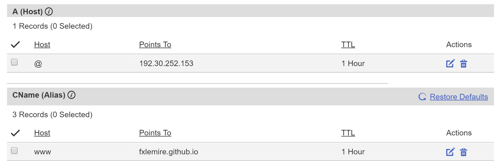

How To Have Your Own Blog Hosted On GitHub For Free
===================================================

# Set Up Your Domain

* Buy a domain name with your preferred domain name provider
    * Basically, try to find an amazing deal online (coupons) and consider the ongoing price once your deal will be over
    * Also have a look at the services offered. For example, at the time of writing this article, HostGator does not allow you to change your DNS settings. You must contact them in order to do so.
* On GitHub, create a repository called MY_DOMAIN_NAME.github.io
* In the settings of the newly created repository, under Custom Domain Name, fill in www.my_domain_name.com (or any other domain extension you have chosen)
    * GitHub explains [here](https://help.github.com/articles/about-supported-custom-domains/) why it is advised to go with www
* Push the two following files to your repository
    * `echo "www.MY_DOMAIN_NAME.com" > CNAME`
    * `echo "MY_DOMAIN_NAME.github.io" > README.md`
* For testing purposes, you can also push a placeholder website
    * `echo "I'll be back" > index.html`
* Back to your Domain Name Provider, create a A file:
    * Host: @
    * Points To: 192.30.252.153
    * TTL: 1 hour
* And a CNAME:
    * Host: www
    * Points To: MY_DOMAIN_NAME.github.io

* As an optional test, you can verify with the following command that everything seems in order: `dig www.MY_DOMAIN_NAME.com +nostats +nocomments +nocmd`
* Now type the following: `curl www.MY_DOMAIN_NAME.com`
    * Did it print 'I'll be back'? If so, you're all set!

[Official GitHub Documentation](https://help.github.com/articles/using-a-custom-domain-with-github-pages/)

# Use Jekyll

Since Jekyll is not officially supported on Windows, I am using a VM. Read my blog "how to set up a simple VM from scratch" if you need to know how.

* SSH into your VM and install ruby: `sudo apt-get install ruby ruby-dev`
* install jekyll: `sudo gem install jekyll`
* confirm installation with `jekyll -v`
* jekyll new ~/Documents/blog
* cd ~/Documents/blog
* bundle install
* check http://localhost:4000 (on your VM if you haven't done port forwarding)

# TEMP NOTES

* Comments: http://www.perfectlyrandom.org/2014/06/29/adding-disqus-to-your-jekyll-powered-github-pages/
* Themes:
    * http://jekyllthemes.org/themes/strata/
    * http://shaneweng.com/landing-page-theme/
* Tutorial: https://scotch.io/tutorials/getting-started-with-jekyll-plus-a-free-bootstrap-3-starter-theme
    * demo: http://scotch-io.github.io/
    * code: https://github.com/scotch-io/scotch-io.github.io
